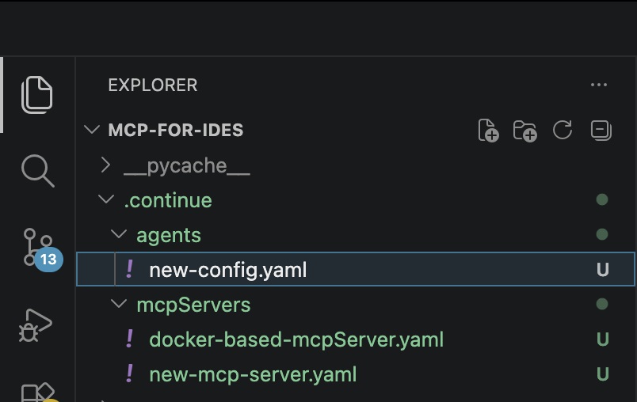
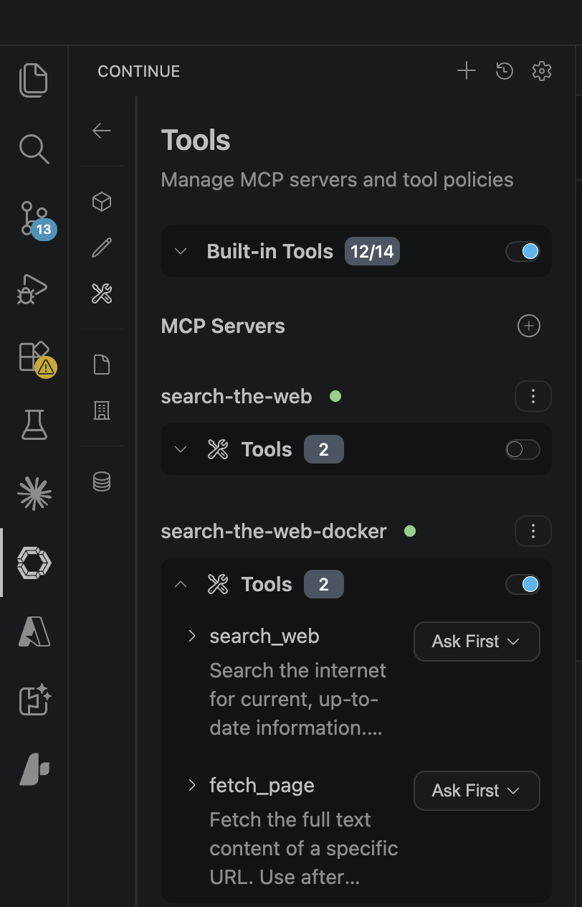
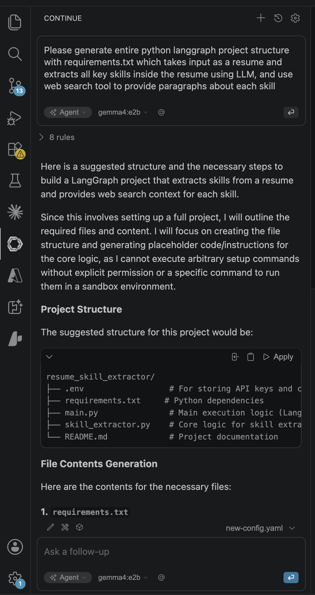
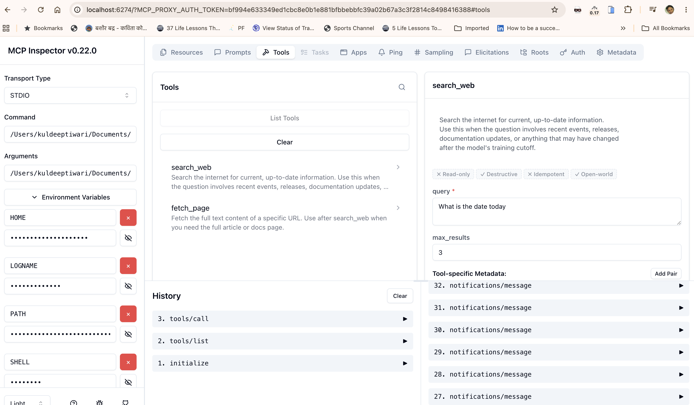

# Zero‑Cost AI Coding Assistant in Your IDE

> Set up a Claude Code / GitHub Copilot–style AI development environment inside your local IDE (VS Code, IntelliJ, …) — **without paying any AI token cost.**

---

## Goal

Modern AI coding assistants (Claude Code, GitHub Copilot, Cursor) are powerful, but they bill you per token and send your code to a third‑party cloud. This project shows how to recreate that same in‑IDE experience using **fully local, open‑source components**.

The result is an AI pair‑programmer that lives inside your editor, understands your codebase, takes actions on your behalf, and can even search the live web — all running on your own machine at **zero token cost** and with your code never leaving your laptop.

The only difference from a commercial assistant is the underlying model: instead of a paid frontier model, you run an open‑source LLM of your choice via [Ollama](https://ollama.com/). For the vast majority of day‑to‑day engineering tasks, these models are more than good enough.

---

## Benefits — What It Can Do

This setup gives you most of what Claude or Copilot offer:

- **🛠️ Debug, refactor, and edit your codebase** — ask questions about your code, fix bugs, refactor functions, or generate new files. (It also handles non‑coding tasks just as well.)
- **🤖 Agent mode** — the assistant doesn't just talk; it *acts*. It can create files, apply multi‑file edits, and execute multi‑step tasks on your behalf.
- **🌐 Live web search** — through a built‑in MCP tool, the model can search the internet for information beyond its training cutoff (recent releases, changelogs, new APIs, current events) and ground its answers in real‑time results.
- **🔒 Private & local** — your source code stays on your machine. The LLM runs locally via Ollama.
- **💸 Zero token cost** — no per‑request billing for the model. (The only optional, nominal cost is the web‑search API — see [Tavily](https://www.tavily.com/pricing), with a free tier of ~1,000 searches/month.)

---

## How It Works — Architecture

The environment is built from three open‑source pieces working together:

| Component | Role |
| --- | --- |
| **[Continue](https://docs.continue.dev/reference)** | An open‑source IDE extension that provides the chat interface, agent mode, and model/tool configuration inside your editor. |
| **[Ollama](https://ollama.com/)** | Downloads and runs open‑source LLMs locally on your machine. |
| **MCP Search Server** | A small [Model Context Protocol](https://modelcontextprotocol.io/) server (shipped in this repo) that gives the LLM real‑time web‑search capability via the Tavily API. |

```
┌──────────────┐      ┌──────────────────┐      ┌─────────────────┐
│   Your IDE   │      │   Continue ext.  │      │  Ollama (local) │
│  (VS Code /  │◄────►│  chat + agent +  │◄────►│   open-source   │
│   IntelliJ)  │      │  tool config     │      │      LLM        │
└──────────────┘      └────────┬─────────┘      └─────────────────┘
                               │
                               │ MCP (stdio)
                               ▼
                      ┌──────────────────┐      ┌─────────────────┐
                      │  MCP Search      │◄────►│   Tavily Web    │
                      │  Server (Docker  │      │   Search API    │
                      │  or local Python)│      └─────────────────┘
                      └──────────────────┘
```

---

## Repository Contents

| Path | Description |
| --- | --- |
| `mcp_search_server.py` | The MCP server exposing `search_web` and `fetch_page` tools backed by the Tavily API. |
| `Dockerfile` | Builds a slim, non‑root container image for the MCP server. |
| `requirements.txt` | Python dependencies for the MCP server (`httpx`, `python-dotenv`, `mcp`). |
| `.continue/agents/new-config.yaml` | Continue agent config — declares the Ollama model and assistant rules. |
| `.continue/mcpServers/docker-based-mcpServer.yaml` | MCP server definition for the **Docker‑based** option. |
| `.continue/mcpServers/new-mcp-server.yaml` | MCP server definition for the **local Python** option. |

---

## Prerequisites

- An IDE: **VS Code** or **IntelliJ** (this guide uses VS Code; the steps are equivalent in other IDEs).
- ~8 GB free disk space for the model and at least **16 GB RAM** for comfortable performance.
- (For the Docker option) **Docker Desktop** installed and running.
- A free **Tavily** account for the web‑search API.

---

## Setup

### 1. Install the Continue extension

In VS Code, open **Extensions** (`Ctrl/Cmd + Shift + X`), search for **“Continue”**, and install it.

### 2. Install Ollama

Download and install Ollama from **https://ollama.com/download**.

### 3. Pull a local LLM

Download the open‑source model of your choice. We tested with **`gemma4:e2b`** — a compact (~7.2 GB) model that runs on a 16 GB‑RAM laptop, offers good reasoning, and — crucially — **supports tool calling** (required for agent mode and web search):

```bash
ollama pull gemma4:e2b
```

> 💡 **Tool calling is essential.** If you swap in a different model, make sure it supports tool/function calling — otherwise agent mode and web search will not work.

### 4. Add the Continue configuration

Copy the `agents` and `mcpServers` folders from this repository into your local `.continue` directory. The resulting structure should look like this:

```
.continue/
├── agents/
│   └── new-config.yaml
└── mcpServers/
    ├── docker-based-mcpServer.yaml
    └── new-mcp-server.yaml
```

<!-- IMAGE PLACEHOLDER: VS Code Explorer showing the .continue folder structure with agents/ and mcpServers/ -->


### 5. Get a Tavily API key

Sign up at **https://www.tavily.com/** and create an API key. Pricing is negligible — the [free tier](https://www.tavily.com/pricing) includes ~1,000 web requests per month, which is plenty for local LLM usage, and paid tiers are very affordable beyond that.

### 6. Configure the MCP web‑search server

Choose **one** of the two options below.

#### Option A — Docker (recommended, simplest)

1. Make sure **Docker Desktop** is installed and running ([install guide](https://docs.docker.com/desktop/)).
2. Pull the prebuilt MCP server image:

   ```bash
   docker pull kuldeepshandilya/mcp-tools-ide:v2
   ```

3. Open `.continue/mcpServers/docker-based-mcpServer.yaml` and set your Tavily API key:

   ```yaml
   name: New MCP server
   version: 0.0.1
   schema: v1
   mcpServers:
     - name: search-the-web-docker
       command: /usr/local/bin/docker   # run `which docker` to find your path
       args:
         - run
         - --rm
         - -i
         - -e
         - TAVILY_API_KEY=<your_Tavily_api_key>   # ← paste your key here
         - kuldeepshandilya/mcp-tools-ide:v2
   ```

#### Option B — Local Python

Run the MCP server directly from this repo instead of Docker.

1. Create a virtual environment and install dependencies in the project folder:

   ```bash
   python3 -m venv .venv
   source .venv/bin/activate        # Windows: .venv\Scripts\activate
   pip install -r requirements.txt
   ```

2. Open `.continue/mcpServers/new-mcp-server.yaml` and set the paths and your Tavily API key:

   ```yaml
   name: New MCP server
   version: 0.0.1
   schema: v1
   mcpServers:
     - name: search-the-web
       command: /path_to_project_folder/.venv/bin/python3   # run `which python3` inside the venv
       args:
         - /path_to_project_folder/mcp_search_server.py
       env:
         TAVILY_API_KEY: <your_Tavily_api_key>
   ```

### 7. Enable the search tool in Continue

In your IDE, click the **Continue** icon in the sidebar → open the **config** (gear) icon → **Tools**. Toggle on the **`search-the-web-docker`** server (or `search-the-web` if you chose the local option).

<!-- IMAGE PLACEHOLDER: Continue Tools panel showing MCP servers with search-the-web-docker enabled -->


> ⚡ **Tip:** Expand a tool and change its approval policy from **“Ask Everytime”** to **“Automatic”** so the agent can create/edit files without prompting you for each action — much faster once you trust the setup.

**That's it!** 🎉

---

## Usage

1. Open the Continue **chat** panel.
2. Make sure the active config is **`new-config.yaml`** and the mode is set to **Agent**.

   > ⚠️ Tool calling (and therefore web search and file actions) is **only supported in Agent mode** — not in Chat or Edit mode.

3. Ask your question.
   - If your tool policy is **“Ask First”**, you'll need to **Approve** tool use and click **Apply / Create** to write files.
   - If your tool policy is **“Automatic”**, the agent creates and edits files autonomously — no clicks required.

<!-- IMAGE PLACEHOLDER: Continue chat in Agent mode generating a full project structure -->


### Example prompt

> *“Please generate an entire Python LangGraph project structure with `requirements.txt` that takes a resume as input, extracts all key skills using the LLM, and uses the web‑search tool to provide a paragraph about each skill.”*

In Agent mode, the assistant will plan the project, use the web‑search tool to gather up‑to‑date information, and scaffold the complete file structure for you.

---

## The MCP Search Server

The included [`mcp_search_server.py`](mcp_search_server.py) is a [FastMCP](https://github.com/modelcontextprotocol) server exposing two tools to the LLM:

| Tool | Purpose |
| --- | --- |
| `search_web(query, max_results=3)` | Searches the internet via Tavily for current, up‑to‑date information (recent events, releases, docs). |
| `fetch_page(url)` | Fetches and cleans the full text content of a specific URL — useful after `search_web` when the model needs the full article. |

The `Dockerfile` packages this server into a slim, non‑root `python:3.12-slim` image communicating over the MCP **stdio** transport, which Continue launches via `docker run`.

---

## Troubleshooting

- **Agent does nothing / no tools appear** — confirm you are in **Agent** mode and that your model supports tool calling. Use mcp dev browser tool to test tools.

```bash
pip install "mcp[cli]"
mcp dev mcp_search_server.py
```

See the list of tools in the 'Tools' tab,  execute the tools and check errors, if any.



- **Web search fails** — verify your `TAVILY_API_KEY` is set correctly in the chosen `mcpServers` YAML, and that the tool is toggled **on** in the Tools panel.
- **Continue tried to use the search-the-web-nondocker-mcp search_web tool** - search_the_web_nondocker_mcp_search_web failed with the message: [{"type":"text","text":"Error executing tool search_web: [SSL: CERTIFICATE_VERIFY_FAILED] certificate verify failed: self-signed certificate in certificate chain (_ssl.c:1010)"}].
Your VPN or corporate network needs to allow calls to taviliy (host='api.tavily.com', port=443)
- **Docker command not found** — run `which docker` (macOS/Linux) or `where docker` (Windows) and update the `command:` path in the YAML accordingly.
- **Slow responses** — try a smaller model, close memory‑heavy apps, or use a machine with more RAM/GPU.

---

